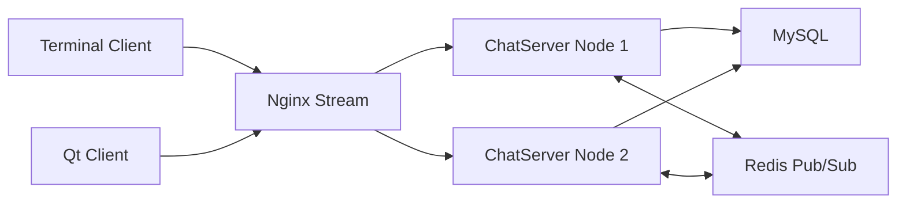

# Cluster Chat Server

基于 Muduo 的分布式集群聊天服务器，支持用户注册登录、私聊、群聊、好友关系、离线消息、MySQL 持久化、Redis Pub/Sub 跨节点转发，以及 Nginx Stream TCP 负载均衡部署。

## 当前能力

- 网络层：基于 Muduo Reactor 模型处理 TCP 长连接。
- 协议层：JSON 消息体 + 4 字节大端长度前缀，解决 TCP 粘包和拆包问题。
- 业务层：支持注册、登录、私聊、群聊、添加好友、创建群组、加入群组、离线消息拉取。
- 数据层：封装 MySQL 访问、连接池、用户/好友/群组/离线消息模型。
- 分布式：通过 Redis Pub/Sub 转发跨服务器消息，通过 Nginx Stream 做 TCP 负载均衡。
- 客户端：提供终端客户端和 Qt Widgets 图形客户端。

## 架构图



## 目录结构

```text
conf/             Server config
include/          Public headers
sql/              MySQL schema and optional seed data
src/server/       Muduo chat server
src/client/       Terminal client
src/qt-client/    Qt Widgets client
third_party/      Header-only nlohmann/json
```

## 构建要求

- CMake >= 3.16
- C++11 compiler
- Muduo
- MySQL client library
- hiredis
- pthread
- Qt 5/6 Widgets（仅构建 Qt 客户端时需要）

仓库只保留 `third_party/json.hpp`，Muduo、hiredis、MySQL、Nginx 需要通过系统环境或源码安装。

## 数据库初始化

```bash
mysql -uroot -p < sql/schema.sql
mysql -uroot -p < sql/seed.sql
```

`schema.sql` 只包含干净的建库、建表、索引和外键。`seed.sql` 是可选演示数据，默认账号为 `alice`、`bob`、`charlie`，密码均为 `123456`。

## 构建

```bash
mkdir build
cd build
cmake ..
make -j$(nproc)
```

默认构建产物：

- `ChatServer`
- `ChatClient`
- `ChatClientQt`

如果本机没有 Qt，可以临时在 `src/CMakeLists.txt` 中注释 `add_subdirectory(qt-client)`。

## 配置

服务端默认读取 `conf/server.conf`，也可以在启动时指定配置文件：

```bash
./bin/ChatServer conf/server.conf
```

配置项包括服务监听地址、MySQL 连接信息、连接池大小和 Redis 地址。

## 运行示例

启动服务端：

```bash
./bin/ChatServer conf/server.conf
```

启动终端客户端：

```bash
./bin/ChatClient 127.0.0.1 12345
```

启动 Qt 客户端：

```bash
./bin/ChatClientQt -H 127.0.0.1 -P 12345
```

Nginx Stream 示例：

```nginx
stream {
    upstream chat_server {
        server 127.0.0.1:6000 weight=1 max_fails=3 fail_timeout=30s;
        server 127.0.0.1:6002 weight=1 max_fails=3 fail_timeout=30s;
    }

    server {
        listen 8000;
        proxy_pass chat_server;
    }
}
```

## 测试记录

当前仓库保留核心源码和数据库脚本，旧的手工实验测试已清理。正式简历版本建议重新补充以下可复现测试：

| 测试类型 | 覆盖内容 | 当前状态 |
| --- | --- | --- |
| 功能测试 | 注册、登录、重复登录、私聊、群聊、好友、离线消息 | 待补充 |
| 协议测试 | 粘包、拆包、非法 JSON、缺字段、超大帧 | 待补充 |
| 分布式测试 | 多 ChatServer 节点、Nginx 转发、Redis 跨节点投递 | 待补充 |
| 稳定性测试 | 断线、重连、长连接保活、Redis/MySQL 异常 | 待补充 |
| 性能测试 | 并发连接数、消息吞吐量、平均延迟、P95/P99 延迟 | 待补充 |

## 后续优化

- 缩小群聊路径中的锁粒度，避免持锁期间访问 MySQL 或 Redis。
- 将服务端 IO 线程数完全配置化。
- 实现 PING/PONG 心跳和空闲连接清理。
- 优化登录链路和群组查询，减少数据库往返。
- 补充自动化功能测试、跨节点集成测试和压测报告。
