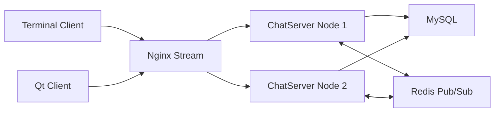
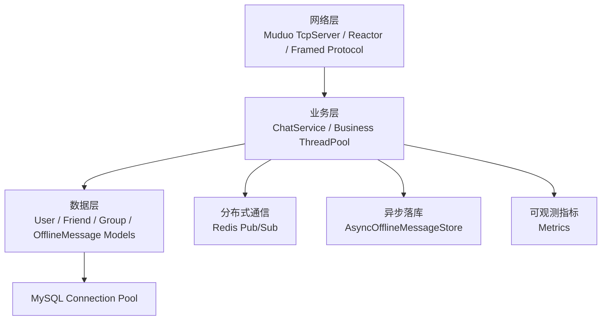

# Cluster Chat Server

基于 Muduo Reactor 的分布式集群聊天服务器。项目从基础聊天功能扩展为包含网络协议、业务线程池、MySQL 连接池、Redis 跨节点通信、Nginx TCP 负载均衡、心跳保活、可观测指标、压测脚本和 Qt 图形客户端的工程化 C/S 系统。

## 项目亮点

- **高并发网络模型**：基于 Muduo Reactor 处理 TCP 长连接，网络 IO 与业务逻辑解耦。
- **业务线程池**：IO 回调只负责拆包、JSON 解析和任务投递，登录、私聊、群聊、离线消息等业务在线程池执行。
- **有序分片调度**：业务线程池按连接 key 分片，保证单连接消息顺序；修复地址低位对齐导致任务集中到单 worker 的问题。
- **分布式通信**：Nginx Stream 做 TCP 负载均衡，Redis Pub/Sub 做跨服务器实时消息转发。
- **故障降级**：Redis 发布失败时降级写入离线消息表，Redis 恢复后自动重连并恢复订阅。
- **群聊热路径优化**：群成员缓存、批量用户状态查询、Redis 发布队列化、异步离线消息批量落库。
- **可观测性**：服务端周期输出 `[METRICS]` 指标，用于定位业务队列、Redis、MySQL 和群聊处理瓶颈。
- **客户端完整度**：提供终端客户端和 Qt Widgets 图形客户端，支持登录、注册、好友、群组、聊天和离线消息展示。

## 功能列表

| 模块 | 能力 |
| --- | --- |
| 用户 | 注册、登录、退出、重复登录检测、在线/离线状态 |
| 聊天 | 私聊、群聊、离线消息、好友添加 |
| 群组 | 创建群组、加入群组、群成员查询 |
| 协议 | 4 字节大端长度帧头 + JSON 消息体，处理 TCP 粘包/半包 |
| 心跳 | Qt 客户端定时 PING，服务端超时检测并清理连接 |
| 分布式 | 多 ChatServer 节点、Nginx TCP 负载均衡、Redis 跨节点投递 |
| 存储 | MySQL 持久化、连接池、离线消息异步批量写入 |
| 测试 | 群聊压测脚本、CSV 输出、服务端指标对照分析 |

## 架构





更多设计说明见 [doc/architecture.md](doc/architecture.md)。

## 目录结构

```text
conf/             服务端与 Nginx 示例配置
doc/              架构说明、测试报告
include/          服务端、客户端头文件
scripts/          群聊压测与查询压测脚本
sql/              MySQL 建表脚本和演示数据
src/server/       Muduo 聊天服务器
src/client/       终端客户端
src/qt-client/    Qt Widgets 图形客户端
third_party/      nlohmann/json 单头文件
```

## 构建要求

- CMake >= 3.16
- 支持 C++20 的编译器
- Muduo
- MySQL client library
- hiredis
- pthread
- Qt 5/6 Widgets（仅构建 Qt 客户端时需要）

仓库只保留 `third_party/json.hpp`。Muduo、hiredis、MySQL、Nginx 需要在本机环境中安装。

## 数据库初始化

```bash
mysql -uroot -p < sql/schema.sql
mysql -uroot -p < sql/seed.sql
```

`schema.sql` 包含建库、建表、索引和外键。`seed.sql` 为可选演示数据，默认账号为 `alice`、`bob`、`charlie`，密码均为 `123456`。

## 构建

```bash
mkdir build
cd build
cmake ..
make -j$(nproc)
```

默认构建产物输出到 `bin/`：

- `ChatServer`
- `ChatClient`
- `ChatClientQt`

如果本机没有 Qt，可以临时在 `src/CMakeLists.txt` 中注释 `add_subdirectory(qt-client)`。

## 配置与运行

服务端默认读取 `conf/server.conf`，也可以启动时指定配置文件：

```bash
./bin/ChatServer conf/server.conf
```

启动终端客户端：

```bash
./bin/ChatClient 127.0.0.1 6001
```

启动 Qt 客户端：

```bash
./bin/ChatClientQt -H 127.0.0.1 -P 6001
```

Nginx Stream 示例见 [conf/nginx-chat.conf](conf/nginx-chat.conf)。

## 性能测试结果

核心压测场景：100 人群聊，60 个本机在线用户，20 个远端在线用户，20 个离线用户，32 个发送者，压测 60 秒。

| QPS | 发送消息数 | 本机接收 | 缺失消息 | Redis 发布 | 异步离线落库 | biz_reject | avg_group_us |
| ---: | ---: | ---: | ---: | ---: | ---: | ---: | ---: |
| 10 | 100 | 5900 / 5900 | 0 | 2000 | 2000 | 0 | 1746 |
| 100 | 6000 | 354000 / 354000 | 0 | 120000 | 120000 | 0 | 1357 |
| 500 | 30000 | 1770000 / 1770000 | 0 | 600000 | 600000 | 0 | 1067 |

关键结论：

- 群聊热路径优化后，100 QPS、8 发送者场景下吞吐从 `1675.33 msg/s` 提升到 `5898.99 msg/s`，约 `3.5x`。
- 业务线程池分片修复后，500 QPS 压测中 `biz_reject=0`，业务队列不再打满。
- 异步离线落库后，500 QPS 下 `avg_group_us` 从约 `5691us` 降到 `1067us`，约 `5.3x`。
- 500 QPS 高扇出场景下服务端完整处理 `30000` 条群聊，完成 `600000` 次 Redis 发布和 `600000` 行离线消息落库，本机消息缺失为 `0`。

完整测试过程见 [doc/test-report.md](doc/test-report.md)。

## 压测命令示例

```bash
python3 scripts/group_chat_benchmark.py \
  --server-host 127.0.0.1 \
  --server-port 6001 \
  --qps 500 \
  --duration 60 \
  --local-online 60 \
  --remote-online 20 \
  --total-users 100 \
  --senders 32 \
  --sender-workers 16 \
  --drain-time 100
```

## 后续优化

- 为聊天消息增加业务消息 ID、ACK 和重试机制。
- 将 Redis Pub/Sub 升级为 Redis Stream 或消息队列，增强跨节点消息可靠性。
- 增加 Prometheus 或 HTTP 状态接口，替代纯日志指标。
- 使用 C++/Go 压测客户端进一步评估服务端上限，减少 Python 接收侧对端到端延迟统计的影响。
