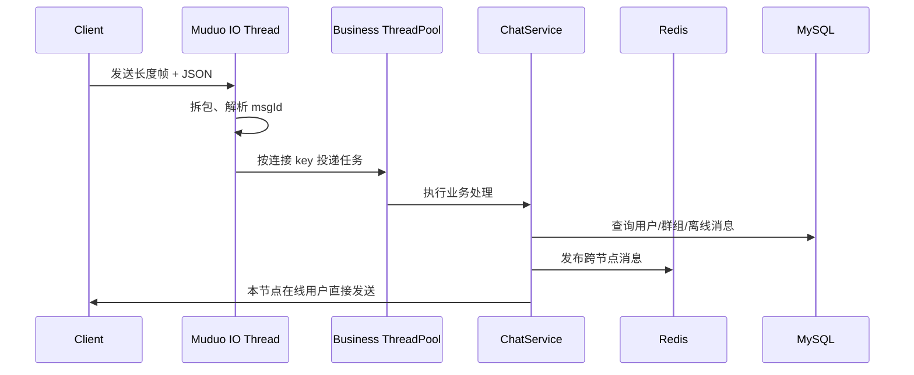

# 架构说明

## 设计目标

该项目的目标不是只实现聊天功能，而是把聊天服务整理成可解释、可扩展、可压测的工程系统。核心思路是把网络 IO、业务处理、数据访问、跨节点通信和指标观测拆开，减少阻塞和耦合。

## 分层结构

| 层次 | 主要文件 | 职责 |
| --- | --- | --- |
| 网络层 | `src/server/ChatServer.cpp`、`include/server/ChatServer.hpp` | Muduo TCP 服务、连接生命周期、拆包、JSON 解析、业务投递 |
| 业务层 | `src/server/ChatService.cpp`、`include/server/ChatService.hpp` | 登录、注册、私聊、群聊、好友、群组、心跳、离线清理 |
| 数据层 | `src/server/model/`、`src/server/db/` | MySQL 连接池、用户/好友/群组/离线消息模型 |
| 分布式通信 | `src/server/redis/` | Redis 发布订阅、跨节点投递、重连恢复、订阅队列 |
| 公共模块 | `src/server/util/`、`src/server/metrics/`、`src/server/config/` | 线程池、SHA256、配置读取、运行指标 |
| 客户端 | `src/client/`、`src/qt-client/` | 终端客户端和 Qt 图形客户端 |

## 请求处理流程

## 高并发设计

### Reactor 与业务线程池

Muduo IO 线程负责连接管理和网络事件处理。服务端收到消息后只做轻量工作：按 4 字节长度帧拆包、解析 JSON、识别 `msgId`，然后把业务任务投递到线程池。

业务线程池处理可能阻塞的逻辑，包括 MySQL 查询、Redis 发布、群聊分发和离线消息处理。这样可以避免数据库或 Redis 的延迟阻塞 IO 线程。

### 单连接有序

业务线程池按连接对象地址生成分片 key，同一连接的消息固定进入同一个 worker 队列，保证登录、聊天、退出等操作在单连接内保持顺序。

压测时发现直接使用地址取模会受内存对齐影响，任务集中到少数 worker。修复方式是在取模前对 key 做位混合，保留同连接有序，同时让多连接任务分布更均匀。

### 群聊热路径

群聊是项目中最容易放大瓶颈的路径，因为一条消息会扇出给本机在线用户、远端在线用户和离线用户。优化重点包括：

- 群成员缓存，避免每条群聊都查询群成员表。
- 批量查询用户状态，减少逐用户 MySQL 请求。
- Redis publish 队列化，降低业务线程等待网络 IO 的时间。
- 离线消息异步批量落库，把 MySQL 写入从群聊热路径拆出。
- 缩小连接表锁粒度，避免持锁访问 MySQL 或 Redis。

## 分布式通信

多节点部署时，Nginx Stream 负责 TCP 负载均衡，Redis Pub/Sub 负责节点间转发。

用户登录后，当前节点订阅该用户 ID 对应的 Redis 频道。发送私聊或群聊时，如果目标用户不在本节点，服务端通过 Redis 发布消息，目标用户所在节点收到后转发给本地 TCP 连接。

Redis Pub/Sub 本身不保证持久化，因此项目增加了降级策略：Redis 发布失败时，把消息写入离线消息表，用户下次登录时仍可拉取。

## 可观测性

服务端通过 `Metrics` 输出关键指标：

- 连接数、在线用户数、JSON 解析成功/失败数。
- 群聊处理数、Redis 发布数、Redis 失败数。
- 业务线程池提交数、完成数、拒绝数、队列长度和排队耗时。
- 群聊平均/最大处理耗时，本机发送耗时，Redis 发布耗时。
- 异步离线落库队列长度、flush 次数、写入行数和 flush 耗时。

这些指标用于把客户端压测结果和服务端内部状态对齐，判断瓶颈到底在 IO、业务线程池、Redis、MySQL 还是压测客户端。
