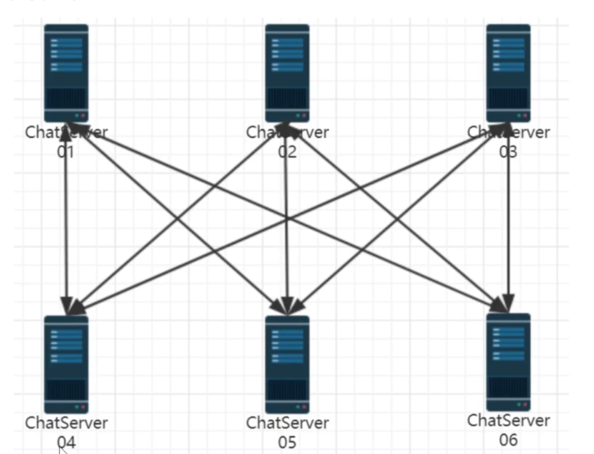
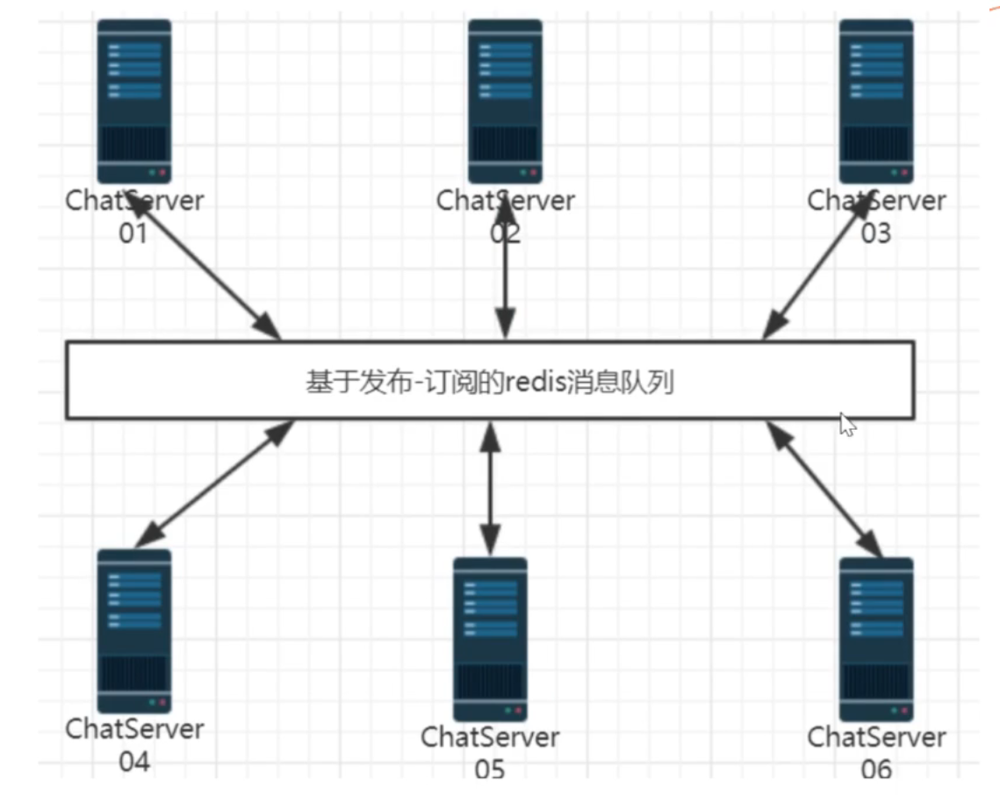

# json
## 序列化与反序列化

### 序列化
- 是把内存中的数据结构转换成可保存或传输的格式
- 例如把 C++ 对象、数组、字典转成一段字符串
- 在你的项目里，`json.dump()` 就是序列化，把 `nlohmann::json` 对象变成 JSON 文本

例子：
```cpp
json js;
js["id"] = 1001;
std::string s = js.dump(); // 得到字符串: {"id":1001}
```

### 反序列化
- 是把保存或传输后的格式还原成内存中的数据结构
- 例如把 JSON 字符串解析成 C++ 对象
- 在你的项目里，`json::parse()` 就是反序列化

例子：
```cpp
std::string s = "{\"id\":1001}";
json parsed = json::parse(s);
int id = parsed["id"];
```

### 直观理解
- 序列化 = 对象 -> 文本/二进制
- 反序列化 = 文本/二进制 -> 对象

这是网络传输、文件存储、跨语言通信时最常用的数据转换方式。

## JSON 是什么

- JSON 全称是 `JavaScript Object Notation`
- 它是一种轻量级的数据交换格式
- 常用于在程序之间传输结构化数据，比如配置、API 请求/响应、序列化对象等

### 特点

- 易读易写
- 基于文本
- 支持对象（键值对）、数组、字符串、数字、布尔值和 `null`

### 例子

```json
{
  "name": "zhang san",
  "id": 1001,
  "tags": ["hello", "world"]
}
```

在你的项目里，`nlohmann/json.hpp` 提供了一个 C++ 库，用来方便地创建、解析和操作 JSON 数据。

## `nlohmann::json` 的基本用法

你的项目里用的是 `nlohmann/json.hpp`，这是一个非常常用的 C++ JSON 库，基本用法如下：

### 1. 引入头文件
```cpp
#include "nlohmann/json.hpp"
using json = nlohmann::json;
```

### 2. 创建 JSON 对象
```cpp
json js;
js["msgid"] = 1;
js["name"] = "zhang san";
js["id"] = 1001;
```

### 3. 创建 JSON 数组
```cpp
json arr = json::array();
arr.push_back(1);
arr.push_back(2);
arr.push_back("hello");
```

或者直接这样：
```cpp
json arr = {1, 2, 3, 4, 5};
```

### 4. 嵌套对象和数组
```cpp
js["msg"]["hello"] = "world";
js["path"] = std::map<int, std::string>{{1, "huangshan"}, {2, "huashan"}};
```

### 5. 序列化（转字符串）
```cpp
std::string s = js.dump();
```

### 6. 反序列化（解析字符串）
```cpp
json parsed = json::parse(s);
```

### 7. 访问值
```cpp
int id = parsed["id"];
std::string name = parsed["name"];
assert(parsed["id"] == 1001);
assert(parsed["msg"]["hello"] == "world");
```

也可以安全访问：
```cpp
if (parsed.contains("id")) { ... }
if (parsed["id"].is_number()) { ... }
```

### 8. 与 STL 类型互转
```cpp
std::vector<int> v = {1, 2, 3};
js["id"] = v;               // 自动转换成 JSON 数组
std::map<std::string, int> m = {{"a", 1}, {"b", 2}};
js["map"] = m;              // 自动转换成 JSON 对象
```

### 9. 自定义结构体转换
你还可以定义 `to_json` / `from_json`，让结构体直接转换：
```cpp
struct Person { std::string name; int age; };

void to_json(json& j, const Person& p) {
    j = json{{"name", p.name}, {"age", p.age}};
}

void from_json(const json& j, Person& p) {
    j.at("name").get_to(p.name);
    j.at("age").get_to(p.age);
}
```

### 10. 推荐用法
- 用 `dump()` 序列化
- 用 `parse()` 解析
- 用 `contains()` / `at()` 做安全访问
- 用 `get<T>()` 或 `get_to()` 做类型转换

---

这就是 `nlohmann/json` 的基本用法，与你的 `tests/json_test.cpp` 里写的代码几乎一致。

## JSON 对象 vs JSON 数组

### 区别

- JSON 对象：一组键值对，类似 C++ 的 `std::map` / `std::unordered_map`
- JSON 数组：按顺序排列的值列表，类似 C++ 的 `std::vector`

### 在 `nlohmann::json` 中

- 创建对象：
  ```cpp
  json js;
  js["name"] = "zhang san";
  js["id"] = 1001;
  ```
  结果类似：
  ```json
  {
    "name": "zhang san",
    "id": 1001
  }
  ```

- 创建数组：
  ```cpp
  json arr = json::array();
  arr.push_back(1);
  arr.push_back(2);
  arr.push_back("hello");
  ```
  或：
  ```cpp
  json arr = {1, 2, 3, 4, 5};
  ```
  结果类似：
  ```json
  [1, 2, "hello"]
  ```

### 语义区别

- 对象用来表示“属性/字段集合”，每个元素都有一个名称（键）
- 数组用来表示“有序列表”，元素通过位置索引访问

### 访问方式

- 对象：`js["name"]`
- 数组：`arr[0]`

所以本质区别是：
- 对象是“键值对集合”
- 数组是“顺序值列表”

# Muduo

## `Muduo`（更常见写法 `Muduo`）网络库基本用法

你目前仓库里 moduo_server.cpp 是空的，没现成例子，所以我这里给你一个通用的 Muduo 用法说明。

### 核心概念

- `EventLoop`：事件循环，必须在一个线程里运行
- `TcpServer`：TCP 服务端
- `TcpClient`：TCP 客户端
- `TcpConnectionPtr`：连接对象，收发数据和关闭连接都通过它
- `InetAddress`：IP/端口地址
- 回调函数：连接事件、消息事件、写完成事件

---

## 服务器基本结构

```cpp
#include <muduo/net/EventLoop.h>
#include <muduo/net/TcpServer.h>
#include <muduo/net/InetAddress.h>
#include <muduo/net/TcpConnection.h>
#include <muduo/net/Buffer.h>

using namespace muduo;
using namespace muduo::net;

void onConnection(const TcpConnectionPtr& conn) {
    if (conn->connected()) {
        printf("Connected: %s\n", conn->peerAddress().toIpPort().c_str());
    } else {
        printf("Disconnected: %s\n", conn->peerAddress().toIpPort().c_str());
    }
}

void onMessage(const TcpConnectionPtr& conn, Buffer* buf, Timestamp time) {
    std::string msg(buf->retrieveAllAsString());
    printf("Recv: %s\n", msg.c_str());
    conn->send("ok\n");
}

int main() {
    EventLoop loop;
    InetAddress listenAddr(12345);
    TcpServer server(&loop, listenAddr, "ChatServer");

    server.setConnectionCallback(onConnection);
    server.setMessageCallback(onMessage);

    server.start();
    loop.loop();
    return 0;
}
```

---

## 客户端基本结构

```cpp
#include <muduo/net/EventLoop.h>
#include <muduo/net/TcpClient.h>
#include <muduo/net/InetAddress.h>
#include <muduo/net/TcpConnection.h>
#include <muduo/net/Buffer.h>

using namespace muduo;
using namespace muduo::net;

void onConnection(const TcpConnectionPtr& conn) {
    if (conn->connected()) {
        conn->send("hello server\n");
    }
}

void onMessage(const TcpConnectionPtr& conn, Buffer* buf, Timestamp time) {
    std::string msg(buf->retrieveAllAsString());
    printf("Server replied: %s\n", msg.c_str());
}

int main() {
    EventLoop loop;
    InetAddress serverAddr("127.0.0.1", 12345);
    TcpClient client(&loop, serverAddr, "ChatClient");

    client.setConnectionCallback(onConnection);
    client.setMessageCallback(onMessage);

    client.connect();
    loop.loop();
    return 0;
}
```

---

## 关键点

- `EventLoop` 只能在一个线程里运行，通常每个 `TcpServer` 只有一个主 loop
- 在回调里使用 `conn->send(...)` 发数据
- `onMessage` 里读取 `Buffer`，常常做协议解析
- 服务器端 `TcpServer::start()` 后调用 `loop.loop()`
- 要关闭连接可以调用 `conn->shutdown()`

## `EventLoop loop;` 的作用

- `EventLoop` 是 Muduo 的事件循环核心
- 它负责监控网络事件（可读、可写、连接断开等）
- 当有事件发生时，它会调用你设置的回调函数

### 在你的程序里，它的工作流程

1. `EventLoop loop;` 创建一个事件循环对象
2. `TcpServer` 用这个 `loop` 来注册 socket、accept 事件等
3. `loop.loop();` 启动循环，不断等待和分发事件

### 为什么必须要它

- 没有 `EventLoop`，`TcpServer` 无法接收连接
- 没有它，`onConnection`、`onMessage` 这些回调就不会执行
- 你可以把它理解成“事件驱动的引擎”

### 关键点

- `EventLoop` 不是线程，它只是事件循环对象
- 通常一个 `TcpServer` 对应一个 `EventLoop`
- 只有 `loop.loop()` 才真正进入运行状态

简而言之：`EventLoop loop;` 是你的服务器能够“听、等、响应网络事件”的基础。
---

## 结论

`moduo`/`Muduo` 的用法本质上就是：
1. 建立 `EventLoop`
2. 创建 `TcpServer` 或 `TcpClient`
3. 设置连接和消息回调
4. 启动服务/连接
5. 进入 `loop.loop()`

## 5 种网络服务器方案
### 方案 1：accept + read/write （非并发服务器）
最原始、最简单、最没用
- 一次只能处理一个客户端
- 处理完这个，才能接下一个
- 只要有一个客户端卡住，所有人都等着
特点：
- 单线程、单进程
- 无并发、无并行
- 只能做 demo，不能上线
### 方案 2：accept + fork () （进程 per 连接）
一个连接 = 开一个子进程
- 优点：简单、稳定、进程隔离
- 缺点：fork 开销巨大，几百个连接就把服务器吃满
适用：
- 并发连接极少（几十以内）
- 业务计算很重 > fork 开销（比如视频转码）
### 方案 3：accept + thread （线程 per 连接）
一个连接 = 开一个线程
- 比 fork 轻，但线程依然很重
- 连接一多，线程爆炸、CPU 切换疯涨
- 高并发下直接卡死
特点：
- 比方案 2 好一点，但依然不适合高并发
- 连接数 > 1000 就不行
### 方案 4：reactor in threads /one loop per thread （muduo 核心架构）
目前高性能服务器的主流标准方案
- one loop per thread：每个线程跑一个事件循环（epoll）
- 主 reactor 负责 accept，子 reactor 负责读写
- 多路复用 + 非阻塞 IO，百万连接无压力
优点：
- 极轻量、无进程 / 线程爆炸
- CPU 利用率极高
- 工业级：Nginx、Redis、muduo、skynet 都用这套
### 方案 5：reactor in process /one loop per process
多进程版 Reactor
- 每个进程跑一个独立的 reactor
- Nginx 就是这种模型
- 进程隔离，稳定性极高，一个进程挂了不影响其他
优点：
- 稳定性最强
- 适合网关、代理（Nginx）

## Reactor Pattern
Reactor = IO 事件分发器
监听所有 socket 读写、连接事件，事件来了再调度业务处理，单线程就能管理海量连接。
### 核心三要素

1. 事件源：客户端连接、读、写、异常
2. 多路复用器：epoll/select/poll，批量监听事件
3. 事件处理器：收到事件，执行对应读写业务

### 工作流程

1. Reactor 阻塞等待 IO 事件
2. 有事件触发，唤醒返回就绪 socket
3. 分发事件给对应回调函数处理
4. 处理完继续等待下一轮事件

### 经典架构形态

- 单 Reactor 单线程：简单小型服务
- 单 Reactor 多线程：IO 收发包、线程池执行业务
- 主从 Reactor 多线程（Muduo）主 Reactor：专门 accept 新连接从 Reactor：分管连接读写事件

## 集群服务器引用——负载均衡器

### 负载均衡器的作用
1. 把client的请求按照负载算法分发到具体的业务服务器
2. 能够和ChatServer保持心跳机制，监测ChatServer故障
3. 能够发现新添加的ChatSeryéer设备，方便扩展服务器数量
### 选择nginx的tcp负载均衡模块
1. 如何进行nginx源码编译，包含tcp负载均衡模块
2. nginx.conf配置文件中如何配置负载均衡
3. nginx的平滑加载配置文件启动

## 集群服务器——跨服务器通信问题
### 集群服务器之间的通信设计


1. 上面的设计，让各个ChatServer服务器互相之间直接建立TCP连接进行通信，相当于在服务器网络之间进行广播。
    - 这样的设计使得各个服务器之间耦合度太高，不利于系统扩展，
    - 并且会占用系统大量的socket资源，各服务器之间的带宽压力很大，
    - 不能够节省资源给更多的客户端提供服务，因此绝对不是一个好的设计




2. 集群部署的服务器之间进行通信，最好的方式就是引入中间件消息队列，解耦各个服务器，使整个系统松耦合，提高服务器的响应能力，节省服务器的带宽资源，如上图所示：
- 在集群分布式环境中，经常使用的中间件消息队列有ActiveMQ、RabbitMQ、Kafka等，都是应用场景广泛并且性能很好的消息队列，供集群服务器之间，分布式服务之间进行消息通信。
- 限于我们的项目业务类型并不是非常复杂，对并发请求量也没有太高的要求，因此我们的中间件消息队列选型的是一基于发布-订阅模式的redis

## 中间件redis

## 观察者模式

## tcp粘包问题

### TCP 是字节流，不是消息流

TCP 只保证两件事：
- 字节按顺序到达
- 字节不丢

**不保证的事**：
- `send()` 和 `recv()` 的次数一一对应
- 数据按 `send()` 时的边界到达

换句话说：TCP 像一根水管，`send()` 往里倒水，`recv()` 从另一端接水。**水管不知道你倒了几次，只关心里面有多少水。**

---

### 粘包是怎么发生的

服务端连续调用 3 次 `send()`，每条约 30 字节：

```
服务端 send("AAA") ──┐
      send("BBB") ──┼── 3次 send 在微秒内完成
      send("CCC") ──┘    数据全部进了内核发送缓冲区

客户端                     recv(fd, buf, 1024) → "AAABBBCCC"
                           一次 recv 全部拿走
```

由于都在本地回环或局域网，延迟极低，客户端还没来得及读，服务端已经把 3 条消息全发到内核缓冲区了。等客户端调用 `recv()` 时，缓冲区里已经有了全部字节，**一次全部读出**。

这就是为什么客户端的 `while` 循环明明在跑，却只进了一次循环体——第一次 `recv()` 就把所有数据拿走了，第二次 `recv()` 时缓冲区已经空了。

### 拆包是怎么发生的

反过来，如果一条消息很大（比如 2000 字节），TCP 可能把它分成多个 IP 包发送。客户端一次 `recv()` 可能只拿到前半部分：

```
服务端 send(2000字节) ─→ TCP分成两段 ─→ 客户端 recv(buf,1024) → 只拿到1024字节
```

JSON 不完整，`json::parse()` 同样失败。

### send 3 次 ≠ recv 3 次

这是最容易搞错的地方。对比两种协议：

| | UDP（数据报） | TCP（字节流） |
|---|---|---|
| 边界 | 每个包独立 | 无边界 |
| send/recv 关系 | sendto 1次 = recvfrom 1次 | send N次，recv M次，M 和 N 无关 |
| 类比 | 快递包裹 | 水管流水 |

- M 可能 = 1（粘包：3 条消息一次性读出来）
- M 可能 > N（拆包：1 条消息分 3 次才读完）
- M 可能 == N（**巧合，不可依赖**）

### 解决方法：长度前缀帧协议

在每条消息前面加 4 字节的**大端长度头**，告诉接收方"这条消息有多长"。

发送端（`sendFramed`）：
```
原始消息: {"msgId":5,"message":"hello"}          ← 28 字节
实际发送: [0x00 0x00 0x00 0x1C]{"msgId":5,"message":"hello"}
          \___ 4字节=28(大端) _/ \_______ 28字节消息 __________/
```

接收端（`recvFramedMessage`）：
```
while (true) {
    1. recvAll(4字节)     → 知道长度 N
    2. recvAll(N字节)     → 拿到完整的 1 条消息
    3. 继续下一轮
}
```

**核心思想**：在 TCP 字节流之上人工定义消息边界，把"字节流"变成"消息流"。

无论 TCP 怎么合并（粘包）或分段（拆包），接收方都能精确切出每条消息：

```
缓冲区实际内容: [len1][msg1][len2][msg2][len3][msg3]
                                  ↑ 混在一起也没关系
接收方:
  recvAll(4) → len1=28 → recvAll(28) → msg1 ✓ 读完, 指针停在 len2
  recvAll(4) → len2=30 → recvAll(30) → msg2 ✓ 读完, 指针停在 len3
  recvAll(4) → len3=26 → recvAll(26) → msg3 ✓
```

### 为什么不用其他方案

| 方案 | 问题 |
|------|------|
| 分隔符（如 `\n`） | 消息内容本身可能包含分隔符，需要转义，麻烦且易出错 |
| 固定长度 | 浪费带宽，消息长度不可变 |
| 长度前缀 | 最常用，HTTP/2、WebSocket、gRPC 都在用 |

### 本项目中的应用

- **旧代码**：`conn->send(js.dump())` + `recv(buf, 1024)` — 无帧协议，粘包必崩
- **新代码**：`sendFramed(conn, js.dump())` + `recvFramedMessage(fd, msg)` — 每条消息带 4 字节长度头
- **实现位置**：`src/server/ChatService.cpp` 的 `sendFramed()`，`src/client/Client.cpp` 的 `recvFramedMessage()`/`sendFramedMessage()`
- **测试代码**：`tests/framing/` 目录，分别对比新旧方案的粘包行为


